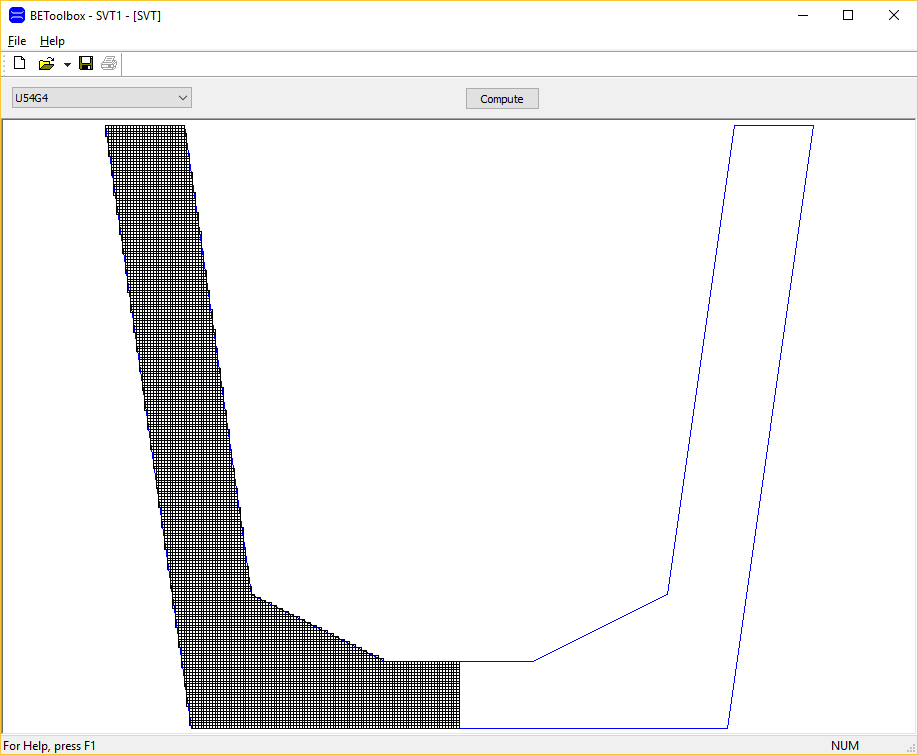

================================
St. Venant Torsional Constant
================================
This program computes J for a predefined precast, prestressed bridge girder.

Operations
----------
#. Select a girder type from the drop down list
#. Press [Compute] to get J

General Information
-------------------
The table below provides general information (this is really just to learn how to make a table with reST)
+----------------------------+-----------------------------------------------------------------------+
| Item                       | Description                                                           |
+============================+=======================================================================+
| Main Window                | This window shows the girder cross section and finite difference grid |
+----------------------------+-----------------------------------------------------------------------+
| Control Bar                | The control bar has the drop down list and the [Comptue] button       |
+----------------------------+-----------------------------------------------------------------------+

This is what the main window looks like (learing how to add an image)

